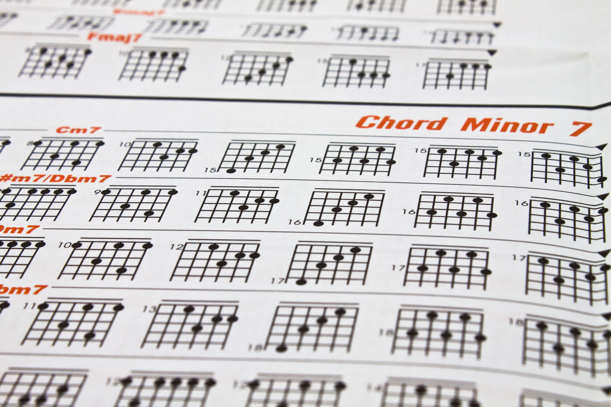

Suppose you are trying to play a new song on a guitar. All the notes may have seemed incomprehensible in the beginning, with the chords really hard to memorize. Then when you find guitar tabs-just simple charts showing you where to put your fingers on the fretboard-really, the only thing left to do is follow the directions and play. Over time, as you progress, you'll become aware of deeper structure in the music-maybe even start composing your own tunes. A design pattern is similar to the guitar tablature in developing the software: rather than seeking to solve any given problem, you have to get into a "pattern" or structure that already has proved to work. Just like guitar tabs guide you through a song, design patterns guide you through common problems in coding, making the development process faster and easier.

This tab is not intended to be a fully fleshed-out guide to show every single note, as one would read from sheet music. This is showing where on the strings you are placing your fingers. For example, it will say take the third string, second fret, and strum the open fifth string. It's simple and it works. Just like how these guitar tabs make it way easier to learn a song, design patterns make coding way simpler because they give some kind of pre-crafted solution to common obstacles. One of the beautiful things about guitar tabs is how consistent they are.
And once you learn any song from the tabs, well, you can play it at any moment in time and it's going to be the same; every time you get comfortable with some given design pattern, you might just be able to use it in other places, which means you solve one problem and you don't have to redo it every time.

Like guitar tabs, design patterns are flexible. You can take any generic pattern and rework it to meet your own needs. Just like the guitarist took her song and made it her own, so too does the developer modifying that design pattern to fit her own project.
When a number of guitarists are playing in a band, one follows the same song, but each player brings with him something different: either a lead guitar riff, a bass line, or a drum beat. In this respect, design patterns allow developers in a team to get along in the same manner because they all follow the same "tabs," but may apply different skills to various parts of the project. Design patterns save the developer from having to invent the wheel every time. Much as the guitarist learns tabs in order to be able to play recognizable pieces, so too does the developer applies the design pattern which has gone well in similar projects. The latter helps speed up the development and makes software well-organized and easy to support.

Design patterns, in a nutshell, are the tablature for programming. They provide developers with a straightforward, repeatable method of solving common coding problems. In the same way that guitar tabs enable musicians to learn songs without understanding every single detail, design patterns allow developers to write clean, maintainable code without having to reinvent the wheel every time. By learning design patterns, developers can solve problems much faster, just like a guitarist who has learned tabs to play a song. And with experience, these patterns start becoming second nature, and a developer's mind will shift to the bigger picture of designing software that works-beautifully, just as in playing music beautifully.

This is a website I built using Bootstrap 5: 

