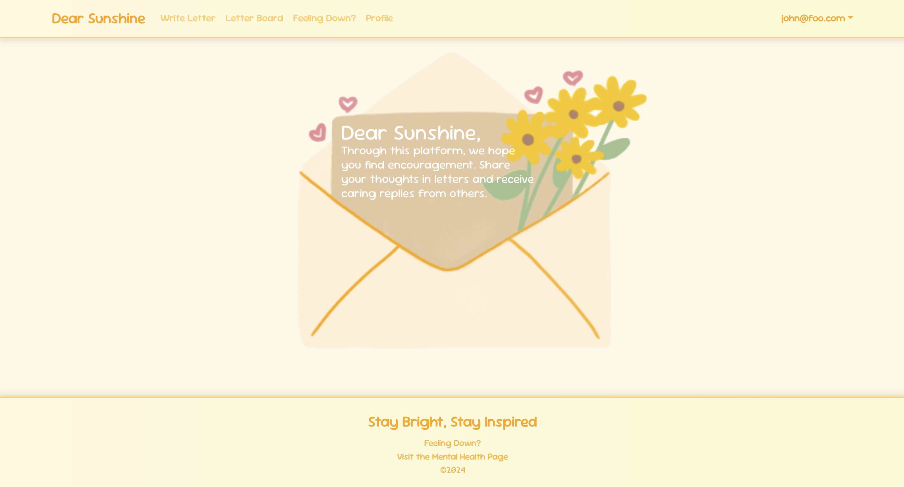
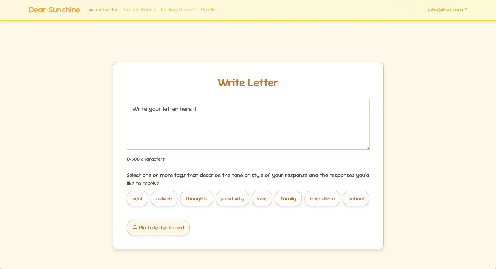
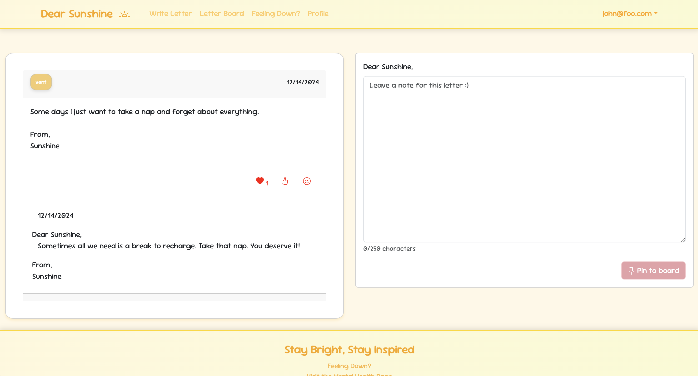
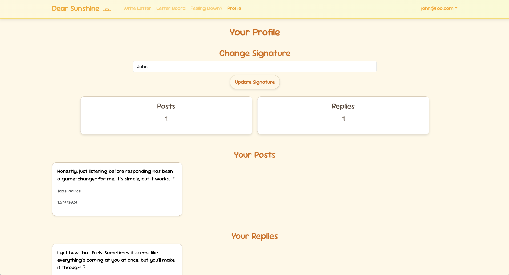
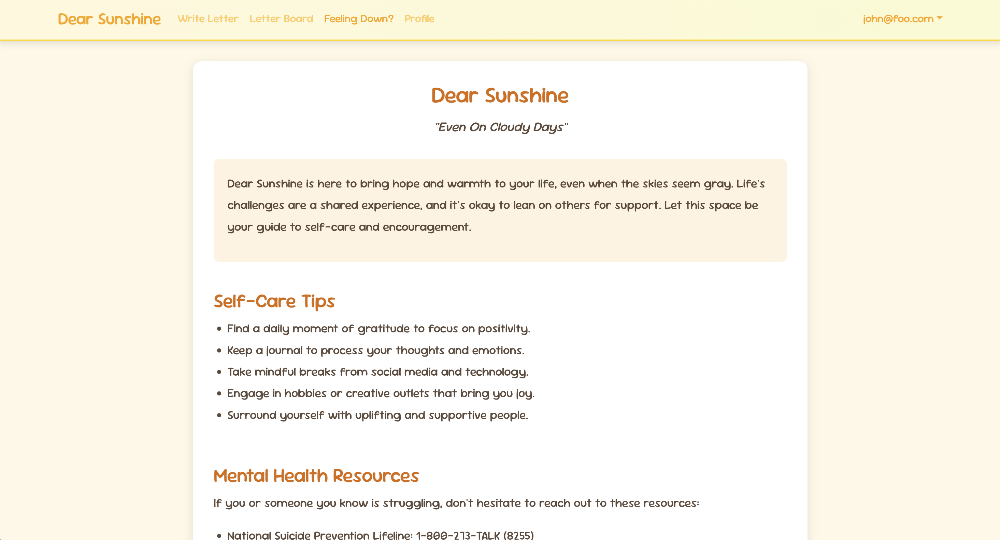
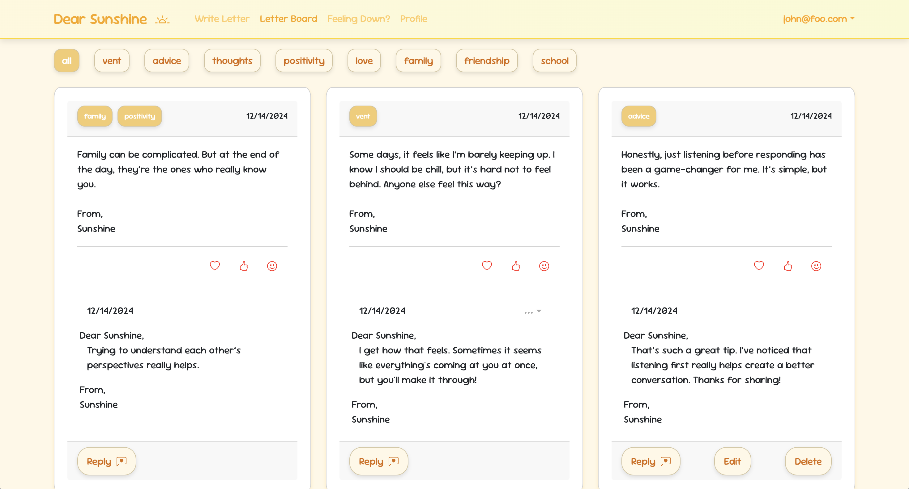

  

    

      
    

    

      
    

    

      
    

  

  

    

      
    

    

      
    

    

      
    

  

In my 314 class, Dear Sunshine was my final project. I worked with a group to help create this website meant to provide users with a space for emotional support and encouragement. Users can post letters anonymously to a "letter board" to share their thoughts or seek uplifting messages. Community members can reply with supportive messages or reactions, fostering a positive and kind environment.

Key features of **Dear Sunshine** include:

1. **Letter Posting & Tagging**: 
- Users can write and post small letters (up to 500 characters) expressing their thoughts, vent, or seeking encouragement.
- In addition, each letter will be able to be tagged with specific categories - example "support," "vent," "advice" - to help others understand the nature of such messages and respond appropriately to the same.

2. **Letter Board**:
- The main interface of the platform, where all posted letters are displayed chronologically.
- Users can filter the letter board by tags to find content that resonates with their current mood or needs.

3. **Replies and Reactions**: 
- Users can respond to letters with short, supportive replies (max 250 characters) to provide encouragement and empathy.
- The "like" or "heart" kind of reactions are available, too, for expressing solidarity and support without having to write a full response.

4. **User Profiles**:
- User profile: Here, every user can view and manage their letters and replies.
- The user will be able to change his/her signature; by default, it would be "Sunshine," and that's how the signature goes at the bottom of a post or reply.

5. **Mental Health Resources**:  
- A dedicated page provides users with practical self-care tips, mental health advice, and links to professional helplines, ensuring users have immediate support when needed.

6. **Authentication & Security**:  
- Secure login and registration processes ensure the protection of users' personal information. Password management features allow users to securely change their passwords when needed.
We built it using PostgreSQL, Prisma, and Node.Js and we used GitHub for source code management

[Visit the deployed application](https://dearsunshine.vercel.app)
[View the GitHub Organization](https://github.com/dear-sunshine)

In the development of Dear Sunshine, I worked mostly on the design and front-end user experience. I created the most of the design mockups and developed an intuitive, user-friendly interface. I also contributed to back-end development, such as creating features that allow users to put their signature on their profile as their signature and salutation. This feature automatically personalizes responses by adding a salutation while replying to others, such as "Dear [username]", to add a touch of community and friendliness.

